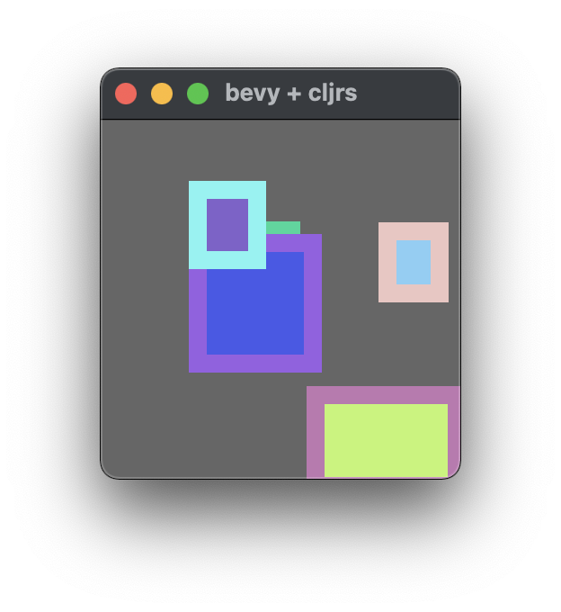

# prototype of a [Bevy] app with a [Clojure] scripting environment

Clojure scripting environment provided by the [cljrs] project's _interpreter_.

<small>_cljrs_ is a fork of [ClojureRS]</small>

---



## building and running from source code via [`cargo`]

on the command line in the directory containing *this file*:

```
cargo run
```

### to access a REPL post-`some-user-script.clj` load, pre-`(user/on-startup)`:

```
cargo run -- --with-startup-repl
```

play with changing `user/toggle-selection?` (see `some-user-script.clj`)

(at the Clojure REPL you can enter `:repl/quit` to end that REPL session)

[Bevy]: https://bevyengine.org
[Clojure]: https://clojure.org
[cljrs]: https://github.com/phrohdoh/cljrs
[ClojureRS]: https://github.com/clojure-rs/ClojureRS
[`cargo`]: https://doc.rust-lang.org/cargo
